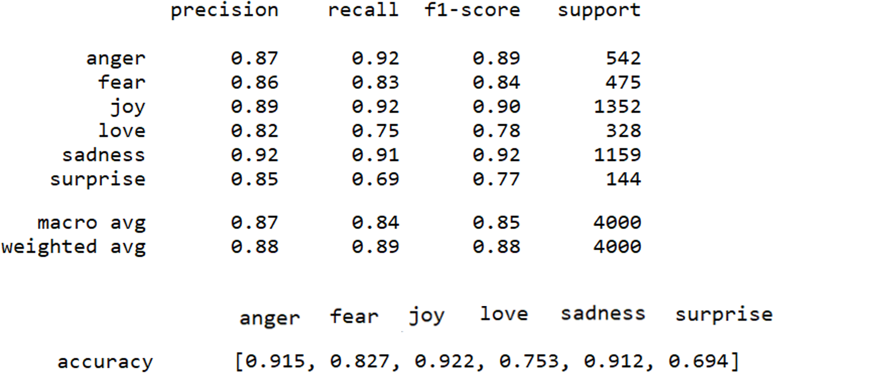
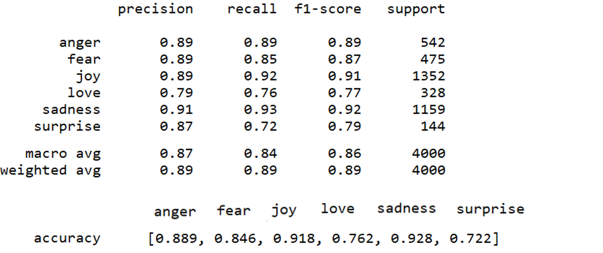

# Capstone Project: Emotion prediction

# Installations
- Python version 3.8.5
- All packages were installed with the Anaconda distribution
- Packages used:
	- pandas
	- pickle
	- nltk
	- sklearn
	- re
	- numpy
	- matplotlib
	- seaborn
	- textblob

# Project Overview and Problem Statement
Detecting emotions is difficult since it is personal, constantly changing, and nuanced.  This goal of this project is to read in a corpus of text data and classify the underlying emotion of the text.  Here, exploratory data analysis, text processing, and machine-learning pieplines were 
applied to classify the text corpus as one of six different emotions: fear, anger, joy, surprise, love, or sadness.  A custom web application was built where a new message can be input and the dashboard displays
the predicted emotion, the sentiment, and an image associated with the emotion.  The images were based on emotion characters from the Disney Pixar movie [Inside Out](https://www.pixar.com/feature-films/inside-out).  

The data was taken from a [Kaggle competition](https://www.kaggle.com/datasets/praveengovi/emotions-dataset-for-nlp) in the NLP category.  Though the given data was already split into different sets, the data was combined here and
then split into train and test sets for this project and stratified by the emotion target.  

# Data preprocessing and Solution Strategy
A tokenize function was created that pulled only alphanumeric characters and ensured all words were lower case. Then the text was tokenized, lemmatized, and stop words were removed.  There were some stop words that occured often and are 
relevant to emotion classification, so a small subset of stopwords were kept within the data.  

Multiple pipelines were created and added to a FeatureUnion to apply different transformers on the same input data.  These transformers were applied in parallel and the output was concatenated.  Then, a ColumnTransformer was used to apply different data
transformations between text and numeric columns.  The resulting preprocessor was used as the first step within the machine learning pipeline.  A RandomizedSearchCV was used instead of a GridSearchCV to save processing time.  Instead of 
trying out all hyperparameter permutations, RandomizedSearchCV trains the model based on a fixed number of hyperparameter combinations sampled from a probability distribution.  

# Metrics
Due to the imbalance of emotions in the dataset (joy=34%, sadness=29%, anger=14%, fear=12%, love=8%, and surprise=4%), the precision and recall were calculated. Here, there was not a need to optimize precision nor recall, so the f1 score was also calculated.  f1 score accounts 
for more extreme values.  Accuracy alone would not provide a wholistic view of the model performance.  A possible next step would be to use over-sampling techniques with the SMOTE package for underreprented categories (fear, love, and surprise).  

# Data Exploration Summary
For detailed analysis, go to the eda.ipynp file or eda.html file.  

# Implementation 

## Model selection
Support vector machines (SVM) were used since the are useful for text categorization for the following reasons [Joachims, Thorsten: Text Categorization with Support Vector Machines: Learning with Many Relevant Features](https://www.cs.cornell.edu/people/tj/publications/joachims_98a.pdf):
- SVMs can handle high dimensional input space.  The TFIDFVectorizer generates a large amount of features from the text data
- SVMs are well suited to handle problems that use sparse matrices.  The TFIDFVectorizer generates a sparse matrix from the text data.
	- SVM determines the best decision boundary between vectors.  We can convert text into vector representations and apply the algorithm to text classificaton problems  

## Module import complication
When running the application and importing functions from the emotions_model.py file, the entire emotions_model.py file was run at the time of import.  After some [research](https://www.pythonmorsels.com/importing-module-runs-code/), I had discovered
that python runs all the code in a module when it is imported, which is known as an import side effect.  To prevent this, I needed to define only functions or other objects within
the emotions_model.py file.  Therefore, I restructured the file to have everything run from a main function which called other functions.  This helped with incorporating DRY principles.  

## Top key words complication
When initially defining the functions to obtain the top keywords associated with each target, there were key words that overlapped.  It was then necessary to create a comparison between all words in each category and use
set theory to obtain words specific to only one emotion label.  

# File descriptions

| Name| Description |
| ----------- | ----------- |
| eda.py|  Script to perform exploratory data analysis |
| eda.ipynb | Jupyter notebook version of eda.py in order to create eda.html |
| eda.html | Html file to view data visualization and EDA results without running a script if needed|
| emotions_model.py| Script that performs data preprocessing and applies, evaluates, and saves a multi-class classification model. |
| emotions_app.ipynb | Jupyter notebook containing custom web application.   |
| model.pkl| Serialized classification model.  This is generated in the emotions_model.py file.|
| data/emotion_corpus.txt | Dataset containing the six emotions for model training and EDA |
| images/*.jpg | Images for the application based on model result | 

# How to interact with this project
The .py files within the repository were designed for others to replicate the analysis if desired.    

## Instructions
1. Run the following commands in the project's root directory to create the model:
	`python emotions_model.py

2. Open an instance of jupyter notebook and run all cells within the emotions_app.ipynb file.  

## Results summary
The following results were after creating several custom features including top key word indicators for each emotion and sentiment score from TextBlob.

The accuracy, precision, recall, and f1 scores for anger, joy, and sadness were the highest, which also corresponds with the most frequently occuring 3 emotions in the dataset.  The results also show the macro and weighted average for precision,
recall, and f1-score.  The macro score calculates metrics for each emotion and finds the unweighted mean, so it does not take target imbalance into account.  This is the arithmetic mean of individual scores.  
The weighted average calculates metrics for each emotion and finds their average based on the number of true instances for each label.  It is an extension of the macro score in that it accounts for label imbalance.  

When refining the pre-processing step using the TFIDFVectorizer with a custom tokenize function (see Data Preprocessing section), the performance did not change drastically compared to using a basic tokenizer that removed stop words and only selected alphanumeric characters:

# Licensing, Authors, Acknowledgements
Thank you to Kaggle for making the data accessible.  Thank you to Udacity for the learnings used from previous projects and applied here.  Thank you to [Zolzaya Luvsandorj](https://zluvsand.github.io/) whose articles covered more advanced
NLP concepts that were applied here and the [Charming Data Channel](https://www.youtube.com/channel/UCqBFsuAz41sqWcFjZkqmJqQ) whose videos covered more advanced web-application topics.    