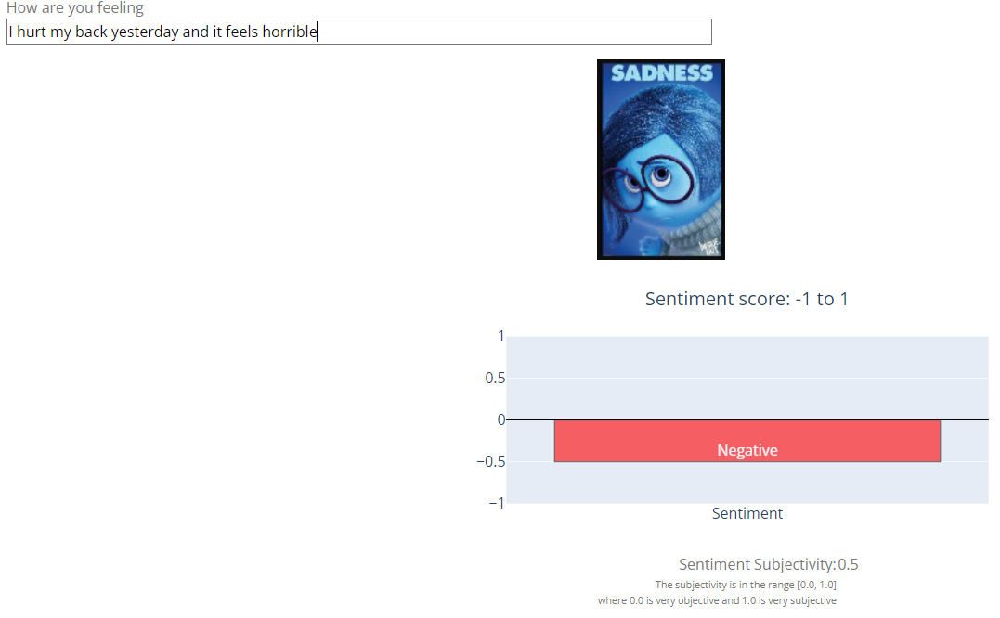
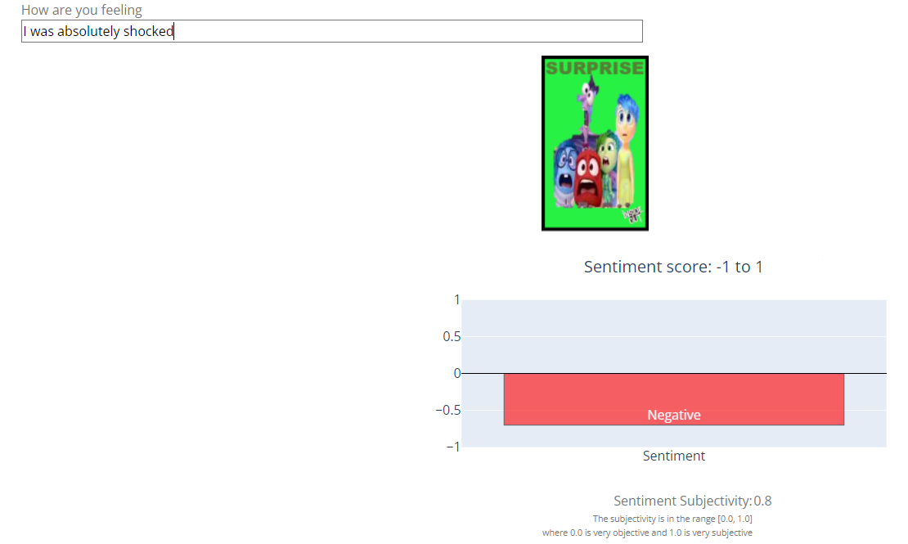
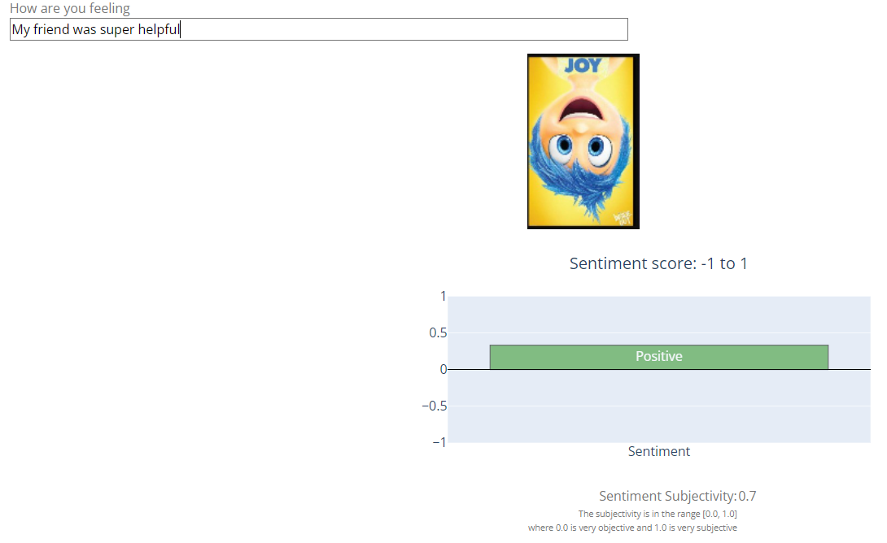

# Capstone Project: Emotion prediction

# Installations
- Python version 3.8.5
- All packages were installed with the Anaconda distribution
- Packages used:
	- pandas
	- pickle
	- nltk
	- sklearn
	- re
	- numpy
	- matplotlib
	- seaborn
	- textblob

# Project Overview and Problem Statement
Detecting emotions is difficult since it is personal, constantly changing, and nuanced.  This goal of this project is to read in a corpus of text data and classify the underlying emotion of the text.  Here, exploratory data analysis, text processing, and machine-learning pipelines were 
applied to classify the text corpus as one of six different emotions: fear, anger, joy, surprise, love, or sadness.  A custom web application was built where a new message can be input and the dashboard displays
the predicted emotion, the sentiment, and an image associated with the emotion.  The images were based on emotion characters from the Disney Pixar movie [Inside Out](https://www.pixar.com/feature-films/inside-out).  

The data was taken from a [Kaggle competition](https://www.kaggle.com/datasets/praveengovi/emotions-dataset-for-nlp) in the NLP category.  Though the given data was already split into different sets, the data was combined here and
then split into train and test sets for this project and stratified by the emotion target.  

# Data preprocessing and Solution Strategy
A tokenize function was created that pulled only alphanumeric characters and ensured all words were lower case. Then the text was tokenized, lemmatized, and stop words were removed.  There were some stop words that occured often and are 
relevant to emotion classification, so a small subset of stopwords were kept within the data.  

Multiple pipelines were created and added to a FeatureUnion to apply different transformers on the same input data.  These transformers were applied in parallel and the output was concatenated.  Then, a ColumnTransformer was used to apply different data
transformations for text and numeric columns.  The resulting preprocessor was used as the first step within the machine learning pipeline.  Cross-valdiation was performed using a RandomizedSearchCV with 3-folds instead of a GridSearchCV to save processing time.  Instead of 
trying out all hyperparameter permutations, RandomizedSearchCV trains the model based on a fixed number of hyperparameter combinations sampled from a probability distribution.  

The functions listed in the table below are all within the emotions_model.py file.  They are listed along with the corresponding technical component of this project.

| Function | Associated Technical Component |
| ----------- | ----------- |
| *count_tokens*|  Feature engineering|
| *count_n_char* | Feature engineering |
| *get_all_words* | Feature engineering|
| *get_top_pctile_words*| Feature engineering |
| *get_top_words_per_emotion_idx* | Feature engineering |
| *load_data* | Data load to workspace|
| *set_train_test_sets* | Preparation for model fitting |
| *generateSentiment*| Feature engineering | 
| *apply_features*| Feature engineering | 
| *tokenize*| Preprocessing | 
| *tokenize_and_join*| Preprocessing | 
| *set_pipelines*| Preprocessing, model fitting, and hyperparameter tuning| 
| *get_performance*| Model evaluation| 
| *save_model*| Model serialization| 
| *load_model*| Model deserialization| 

The application was custom developed using the plotly-dash packages.  Initially, the layout was built and an initial callback that changed the image based on a dropdown component was created.  That same
callback logic was then used once the model was deserialized within the application, so the image was then changed based on the model prediction.  The sentiment was then added to a graph
within the application, and positive and negative sentiment were color-coded in green and red, respectively.

# Metrics
Due to the imbalance of emotions in the dataset (joy=34%, sadness=29%, anger=14%, fear=12%, love=8%, and surprise=4%), the precision and recall were calculated. Here, there was not a need to optimize precision nor recall, so the f1 score was also calculated.  f1 score accounts 
for more extreme values.  Accuracy alone would not provide a holistic view of the model performance.   

# Data Exploration Summary
For detailed analysis and data visualizations, go to the eda.html file or run the eda.ipynb/eda.py files.  

# Implementation 

## Model selection
Support vector machines (SVM) were used since they are useful for text categorization for the following reasons [Joachims, Thorsten: Text Categorization with Support Vector Machines: Learning with Many Relevant Features](https://www.cs.cornell.edu/people/tj/publications/joachims_98a.pdf):
- SVMs can handle high dimensional input space.  The TFIDFVectorizer generates a large amount of features from the text data
- SVMs are well suited to handle problems that use sparse matrices.  The TFIDFVectorizer generates a sparse matrix from the text data.
	- SVM determines the best decision boundary between vectors.  We can convert text into vector representations and apply the algorithm to text classificaton problems  

## Hyperparameter tuning
SVM models use a hyperplane to split the parameter space for each classification target.  The kernel, C, and gamma parameters were tuned here, and more information about SVM hyperparameter 
tuning can be seen [here](https://towardsdatascience.com/hyperparameter-tuning-for-support-vector-machines-c-and-gamma-parameters-6a5097416167).  The C parameter controls the tradeoff between a smooth
decision boundary and classifying training points correctly.  Large C values will result in getting all training points classified correctly while small C values will result in a smoother boundary.  The hyperparameter space for the C parameter was defined over 4 orders of magnitude to cover both large and small C values.  The gamma parameter defines how much influence a single training
example has.  A higher gamma can result in an intricate decision boundary since points close to the boundary are weighted more heavily.  Finally, the hyperplane can be defined with a linear relatinship or non-linear (polynomial, sigmoid, etc).  Linear 
and non-linear kernels were incorporated into the hyperparameter tuning space.  

## Module import complication
When running the application and importing functions from the emotions_model.py file, the entire emotions_model.py file was run at the time of import.  After some [research](https://www.pythonmorsels.com/importing-module-runs-code/), I had discovered
that python runs all the code in a module when it is imported, which is known as an import side effect.  To prevent this, I needed to define only functions or other objects within
the emotions_model.py file.  Therefore, I restructured the file to have everything run from a main function which called other functions.  This helped with incorporating DRY principles.  

## Top key words complication
When initially defining the functions to obtain the top keywords associated with each target, there were key words that overlapped.  It was then necessary to create a comparison between all words in each category and use
set theory to obtain words specific to only one emotion label.  

# File descriptions

| Name| Description |
| ----------- | ----------- |
| eda.py|  Script to perform exploratory data analysis.  The spyder IDE was helpful to add custom visualizations and explore variables and results.|
| eda.ipynb | Jupyter notebook version of eda.py in order to create eda.html |
| eda.html | Html file to view data visualization and EDA results without running a script if needed|
| emotions_model.py| Script that performs data preprocessing and applies, evaluates, and saves a multi-class classification model. |
| emotions_app.ipynb | Jupyter notebook containing custom web application.   |
| model.pkl| Serialized classification model.  This is generated in the emotions_model.py file.|
| data/emotion_corpus.txt | Dataset containing the six emotions for model training and EDA |
| images/*.jpg | Images for the application based on model result | 
| top_words_per_target.pkl | Serialized dictionary of top percentile words associated with each emotion |

# How to interact with this project
The files within the repository were designed for others to replicate the analysis.    

## Instructions
1. Run the emotions_model.py file in jupyter notebook or another python IDE or run the following command in the project's root directory to create the model : 
	*python emotions_model.py*

2. Open an instance of jupyter notebook and run all cells within the emotions_app.ipynb file.  
3. In the text box, type in how you are feeling.  Try other permutations as desired to see the results.
	- Examples:
		- I was so shocked
		- I am bored out of my mind
		- I hurt my back
		- I am feeling adored
		- I liked my romantic date
		- I was scared in the haunted house

# Model evaluation and validation
The following results were after implementing the TFIDFVectorizer within the pre-processing pipeline and adding the sentiment score from TextBlob on the test set.    

The accuracy, precision, recall, and f1 scores for anger, joy, and sadness were the highest, which also corresponds with the most frequently occuring 3 emotions in the dataset.  The results also show the macro and weighted average for precision,
recall, and f1-score.  The macro score calculates metrics for each emotion and finds the unweighted mean, so it does not take target imbalance into account.  This is the arithmetic mean of individual scores.  
The weighted average calculates metrics for each emotion and finds their average based on the number of true instances for each label.  It is an extension of the macro score in that it accounts for label imbalance.  

## Refinement
When refining the pre-processing step using a custom tokenize function (see Data Preprocessing section) and adding in several custom features including top word indicators for each emotion the performance did not change drastically compared to using a basic tokenizer that removed stop words and only selected alphanumeric characters.
In general, scores increased for most categories by 1%.  

## Hyperparameter optimization

The table below shows the best-fit values for each parameter:

| Parameter| Value |
| ----------- | ----------- |
| kernel|  radial basis function (rbf)|
| C | 10 |
| gamma | 0.1|

The C parameter was one of the higher orders of magnitdue, indicating that the optimization prioritized getting all training points classified correctly.  The gamma parameter was the loweset order
of magnitude, indicating that the optimization had the influence of a single training point as minimal.  

# Sample classification results
The first example shows a classification of sadness with a negative sentiment.  

The second example shows a classification of surprise with a negative sentiment.  The subjectivity is higher because surprise can be positive or negative depending on the situation.  

The third example shows a classification of joy with a positive sentiment.   

# Conclusion
## Reflection
Text classification has numerous applications in a variety of fields.  Here, text classification techniques were used to identify six different emotions from a dataset.  Initially, an
exploratory data analysis process was conducted to find target frequency, top keywords, and other characteristics of the data to help generate features.  Extensive pre-processing was applied here 
based on using multiple pipelines, FeatureUnion, CustomTransformer, and ColumnTransformers.  The classification model was created and serialized after performing a cross validation to find 
the best hyperparameters.  That same model was deserialized and put within a web-application to see a visual representation of the classification associated with an image of characters from the 
Disney-Pixar movie *Inside out*.  The associated sentiment of the input was determined using the TextBlob package.  The custom-built application was especially interesting and specifically how two incorporate a model developed in another file.   

## Improvement
As with many machine learning problems, there are several limitations to this project that, if addressed, may improve the model results.  First, the SVM classifier in scikit-learn has other
model parameters that could be tuned.  Specifically the class_weight parameter to handle drastically imbalanced datasets.  Here, the default was 'balanced', which automatically adjusts weights
inversely proportional to the target frequency.  Regarding target imbalance, a possible next step would be to use over-sampling techniques with the SMOTE package for underreprented categories (fear, love, and surprise). 
Second, the number of cross-validation folds could either be a) increased and b) a full GridSearch could be used to search the entire parameter space.  The RandomizedSearchCV saved processing time for this project, which is why it was chosen over a GridSearchCV.  A [HalfingGridSearchCV](https://scikit-learn.org/stable/modules/grid_search.html#successive-halving-user-guide) could also be used to identify best-fit parameters.  Finally, other classification algorithms could be tested to compare the results; [AutoML](https://towardsdatascience.com/4-python-automl-libraries-every-data-scientist-should-know-680ff5d6ad08) libraries could help with this.  

# Licensing, Authors, Acknowledgements
Thank you to Kaggle for making the data accessible.  Thank you to Udacity for the learnings used from previous projects and applied here.  Thank you to [Zolzaya Luvsandorj](https://zluvsand.github.io/) whose articles covered more advanced
NLP concepts that were applied here and the [Charming Data Channel](https://www.youtube.com/channel/UCqBFsuAz41sqWcFjZkqmJqQ) whose videos covered more advanced web-application topics.    