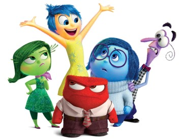

# Capstone Project: Emotion prediction

# Installations
- Python version 3.8.5
- All packages were installed with the Anaconda distribution
- Packages used:
	- pandas
	- pickle
	- nltk
	- sklearn
	- re
	- numpy
	- matplotlib
	- seaborn
	- textblob

# Project Overview and Problem Statement Solution Strategy
Detecting emotions is difficult since it is personal, constantly changing, and nuanced.  This goal of this project is to read in a corpus of text data and classify the underlying emotion of the text.  Here, exploratory data analysis, text processing, and machine-learning pieplines were 
applied to classify the text corpus as one of six different emotions: fear, anger, joy, surprise, love, or sadness.  A custom web application was built where a new message can be input and the dashboard displays
the predicted emotion, the sentiment, and an image associated with the emotion.  The images were based on emotion characters from the Disney Pixar movie [Inside Out](https://www.pixar.com/feature-films/inside-out).  

The data was taken from a [Kaggle competition](https://www.kaggle.com/datasets/praveengovi/emotions-dataset-for-nlp) in the NLP category.  Though the given data was already split into different sets, the data was combined here and
then split into train and test sets for this project and stratified by the emotion target.  

# Solution Strategy and Data Preprocessing

A TfidfVectorizer was used with stop words removed.  Multiple pipelines were created and added to a FeatureUnion to apply different transformers on the same input data.  These transformers were applied in parallel and the output was concatenated.  Then, a ColumnTransformer was used to apply different data
transformations between text and numeric columns.  The resulting preprocessor was used as the first step within the machine learning pipeline.  A RandomizedSearchCV was used instead of a GridSearchCV to save processing time.  Instead of 
trying out all hyperparameter permutations, RandomizedSearchCV trains the model based on a fixed number of hyperparameter combinations sampled from a probability distribution.  

# Metrics
Due to the imbalance of emotions in the dataset (joy=34%, sadness=29%, anger=14%, fear=12%, love=8%, and surprise=4%), the precision, recall, and f1 score were calculated.  Accuracy alone would not provide a wholistic view of the
model performance.  A possible next step would be to use over-sampling techniques with the SMOTE package for underreprented categories (fear, love, and surprise).  

# Data Exploration 
For detailed exploratory data analysis and visualizations, go to the eda.ipynp file.  

# Implementation 

## SVM classifier
It is widely recommended to use Support Vector Machine (SVM) classifiers for text categorization.  SVMs have the potential for large feature spaces, which is the case often for text and for this project after performing the TFIDFVectorizer.  Working with text
data often requires the use of sparse matrices, and SVMs are well suited for this.  [Text Categorization with SVMs Source](https://www.cs.cornell.edu/people/tj/publications/joachims_98a.pdf).
## Challenges with module imports
When running the application and importing functions from the emotions_model.py file, the entire emotions_model.py file was run at the time of import.  After some [research](https://www.pythonmorsels.com/importing-module-runs-code/), I had discovered
that python runs all the code in a module when it is imported, which is known as an import side effect.  To prevent this, I needed to define only functions or other objects within
the emotions_model.py file.  Therefore, I restructured the file to have everything run from a main function which called other functions.  

# File descriptions

| Name| Description |
| ----------- | ----------- |
| eda.py|  Script to perform exploratory data analysis |
| emotions_model.py| Script that performs data preprocessing and applies, evaluates, and saves a multi-class classification model. |
| emotions_app.ipynb | Jupyter notebook containing custom web application.   |
| pipeML.pkl| Serialized classification model.  This is generated in the emotions_model.py file.|
| data/emotion_corpus.txt | Dataset containing the six emotions for model training and EDA |
| images/*.jpg | Images for the application based on model result | 

# How to interact with this project
The .py files within the repository were designed for others to replicate the analysis if desired.    

## Instructions
1. Run the following commands in the project's root directory to set up your database and model.

2. Run the following command in the app's directory to run the web app.
    `python run.py`

3. Go to http://127.0.0.1:3001/

## Data preparation summary  

## Results summary

In looking at the distribution of emotions, joy occurs the most, and surprise occurs the least.  However, grouping joy, love, and surprise together as positive and sadness, anger, and fear together as negative, the sentiment 

# Licensing, Authors, Acknowledgements
Thank you to Kaggle for making the data accessible.  Thank you to Udacity for the learnings used from previous projects and applied here.  Thank you to [Zolzaya Luvsandorj](https://zluvsand.github.io/) whose articles covered more advanced
NLP concepts that were applied here and the [Charming Data Channel](https://www.youtube.com/channel/UCqBFsuAz41sqWcFjZkqmJqQ) whose videos covered more advanced web-application topics.    